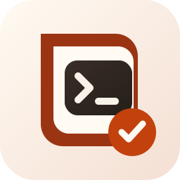

<p align="center">
  
</p>

# Automatizacion-Codex

Utilidad local para Linux que permite explorar sesiones de Codex, generar resúmenes técnicos, reabrir conversaciones y archivar sesiones desde un único lanzador de escritorio.

## Por qué existe

Codex conserva sesiones útiles, pero retomarlas días después no siempre es cómodo: hay que recordar rutas, distinguir conversaciones con títulos pobres y documentar manualmente lo que ya se hizo. Este proyecto convierte ese historial local en un flujo operativo más claro.

## Funcionalidades

- Lista sesiones activas y archivadas de Codex en una tabla legible.
- Filtra sesiones por texto usando ID, ruta, título o primer mensaje.
- Oculta por defecto sesiones cuya carpeta original ya no existe y permite limpiarlas desde el menú con backup previo.
- Muestra fecha de actualización, fecha de inicio, tokens, ruta y estado de resumen.
- Genera resúmenes técnicos asociados al `session_id`.
- Genera tambien una copia Markdown del resumen para lectura o documentacion.
- Permite consultar el último resumen existente sin regenerarlo.
- Reabre sesiones interactivas para continuar trabajando.
- Archiva y desarchiva sesiones sin borrarlas.
- Crea un backup de la base local antes de cambiar el estado de archivado.
- Rota backups antiguos de archivado y limpieza; conserva por defecto los 10 más recientes por tipo.
- Permite modo solo lectura con `CODEX_READ_ONLY=1` para ocultar acciones que modifican SQLite.
- Exporta el diagnostico de sesiones a Markdown desde el menu inicial.
- Abre carpetas de resumenes y backups desde el menu inicial.
- Muestra una vista agrupada por proyecto/carpeta.
- Muestra detalles tecnicos completos de una sesion.
- Permite restaurar backups SQLite desde el menu con confirmacion explicita.
- Permite probar el contenido de un backup antes de restaurarlo mostrando resumen de sesiones.
- Exporta el listado de sesiones visibles a Markdown y CSV.
- Incluye comprobacion automatica de privacidad para evitar subir datos sensibles.
- Detecta automáticamente el binario `codex`, la base `state_*.sqlite` y el Escritorio del usuario, combinando `PATH`, shell de login, prefijo global de npm, rutas habituales y `nvm`.
- Instala un lanzador `.desktop` que respeta el terminal predeterminado mediante `xdg-terminal-exec`.
- Registra tambien una aplicacion de usuario para lanzarla desde GNOME.

## Vista rápida

```text
N   Actualizada      Iniciada         Tokens       Resumen  Ruta                               Descripcion
--- ---------------- ---------------- ------------ -------- ---------------------------------- ------------------------
1   2026-05-18 15:38 2026-05-18 08:48 27.954.698   SI       ~/Escritorio                       Sesion sin titulo util
2   2026-05-08 09:56 2026-05-08 09:17 656.896      NO       ~/Escritorio/calendario-vacaciones $graphify .
```

## Requisitos

- Linux.
- Bash.
- Python 3 con el módulo estándar `sqlite3`.
- Codex CLI instalado y autenticado.
- Sesiones locales de Codex disponibles en `~/.codex/state_*.sqlite`.
- `xdg-terminal-exec` recomendado para abrir el terminal predeterminado.

## Instalación rápida

```bash
mkdir -p "$HOME/Proyectos"
cd "$HOME/Proyectos"
git clone https://github.com/jesusgascon/Automatizacion-Codex.git
cd Automatizacion-Codex
bash instalar.sh
```

Al ser un repositorio público, la instalación no requiere autenticación de GitHub. Si ya usas GitHub CLI, `gh repo clone jesusgascon/Automatizacion-Codex` también funciona.

El instalador:

1. detecta la carpeta de Escritorio,
2. pregunta dónde guardar resúmenes, logs y backups si se ejecuta de forma interactiva,
3. crea la carpeta de salida elegida,
4. genera el lanzador `Resumir sesion de Codex.desktop`,
5. registra `automatizacion-codex.desktop` en el menu de aplicaciones del usuario,
6. marca como ejecutables los archivos necesarios.

La aplicación y su documentación permanecen en la carpeta donde se clona el repositorio. Esa ubicación se decide antes de instalar, al elegir dónde ejecutar `git clone`.

Verificación mínima tras instalar:

```bash
bash -n resumir-sesion-codex.sh instalar.sh
python3 -m unittest discover -s tests -v
grep '^Exec=' "$HOME/Escritorio/Resumir sesion de Codex.desktop" 2>/dev/null || \
grep '^Exec=' "$HOME/Desktop/Resumir sesion de Codex.desktop"
```

Después abre el lanzador y confirma que:

- se muestra la vista inicial,
- aparecen las sesiones del usuario actual,
- puedes generar o consultar un resumen,
- puedes volver atrás con `0` sin cerrar la ventana.

## Uso

1. Abre el lanzador del Escritorio.
2. En la pantalla inicial:
   - `Enter`: sesiones activas,
   - `a`: sesiones archivadas,
   - `d`: resumen de sesiones,
   - `e`: exportar diagnóstico de sesiones,
   - `l`: exportar listado de sesiones,
   - `p`: vista por proyecto,
   - `o`: abrir carpeta de resúmenes,
   - `b`: abrir carpeta de backups,
   - `r`: restaurar backup SQLite,
   - `q`: salir.
3. Selecciona una sesión.
4. Elige una acción:
   - `1`: generar resumen,
   - `2`: abrir sesión,
   - `3`: resumir y abrir,
   - `4`: archivar o desarchivar,
   - `5`: ver el último resumen guardado,
   - `6`: abrir resumen en editor predeterminado,
   - `7`: ver detalles técnicos,
   - `0`: volver.

Desde el listado:

- `f`: filtrar por texto,
- `l`: limpiar el filtro activo,
- `x`: limpiar sesiones con ruta inexistente.

## Dónde guarda los datos

```text
<Carpeta-de-salidas-elegida>/
├── resumen-codex-<session_id>-YYYYMMDD-HHMMSS.txt
├── resumen-codex-<session_id>-YYYYMMDD-HHMMSS.md
├── diagnostico-sesiones-codex-YYYYMMDD-HHMMSS.md
└── logs/
    └── resumen-codex-<session_id>-YYYYMMDD-HHMMSS.log
```

Por defecto, si durante la instalación pulsas `Enter`, `<Carpeta-de-salidas-elegida>` será `<Escritorio>/Documentacion/Codex/Resumenes/`. Si escribes otra ruta, se usará esa.

## Privacidad y seguridad

- El proyecto no sube sesiones ni resúmenes a ningún servicio.
- La lectura del historial se hace sobre la base local de Codex.
- El archivado usa `archived` y `archived_at`; no elimina conversaciones.
- Antes de archivar o desarchivar se guarda una copia local de la base SQLite.
- Los resúmenes personales, bases SQLite y logs no forman parte del repositorio.
- Antes de publicar este repositorio se retiraron rutas concretas, IDs reales y datos de uso personal.

Consulta [Privacidad](docs/privacidad.md) y [Security Policy](SECURITY.md) para más detalle.

## Compatibilidad

| Componente | Estado |
| --- | --- |
| Ubuntu moderno con `xdg-terminal-exec` | Compatible |
| Codex en `PATH` | Compatible |
| Codex instalado mediante `nvm` | Compatible |
| Otros escritorios Linux | Compatible con posible ajuste del lanzador |
| Borrado destructivo de sesiones | Fuera de alcance |

Consulta [Compatibilidad](docs/compatibilidad.md) para más detalle.

## Estructura del proyecto

```text
Automatizacion-Codex/
├── README.md
├── CHANGELOG.md
├── LICENSE
├── CONTRIBUTING.md
├── SECURITY.md
├── manual-completo.html
├── .specify/
├── assets/
├── resumir-sesion-codex.sh
├── instalar.sh
├── docs/
├── gpt-personalizado/
└── plantillas/
```

## Documentación

- [Arquitectura](docs/arquitectura.md)
- [Funcionamiento detallado](docs/funcionamiento-detallado.md)
- [Configuración y mantenimiento](docs/configuracion-y-mantenimiento.md)
- [Instalación y réplica](docs/replicacion-en-otros-equipos.md)
- [Privacidad](docs/privacidad.md)
- [Compatibilidad](docs/compatibilidad.md)
- [Troubleshooting](docs/troubleshooting.md)
- [FAQ](docs/faq.md)
- [Roadmap](docs/roadmap.md)
- [Historial de decisiones](docs/historial-decisiones.md)
- [GPT personalizado documentador](docs/gpt-personalizado-documentador.md)
- [Spec-Driven Development aplicado](docs/spec-driven-development.md)
- [Recuperación desde backups SQLite](docs/recuperacion-backups.md)

## Diseño técnico

- SQLite se usa porque Codex ya mantiene ahí el catálogo local de sesiones.
- Solo se listan sesiones de origen `cli` y `vscode` para evitar ruido interno.
- Las sesiones con títulos pobres no se ocultan; se distinguen por ruta, fechas y tokens.
- `codex exec --ephemeral` permite resumir sin contaminar el historial con otra sesión persistente.
- Los resúmenes nuevos incluyen `session_id` en el nombre para asociarlos sin ambigüedad.
- El filtrado por `HOME` distingue la ruta exacta de subrutas válidas y evita coincidencias solo por prefijo textual.

## Flujo Spec-Driven Development

El proyecto incorpora una capa documental inspirada en GitHub Spec Kit para que las mejoras no se implementen de forma improvisada. La fuente de verdad vive en:

```text
.specify/
├── memory/constitution.md
└── specs/001-gestor-sesiones-codex/
    ├── spec.md
    ├── plan.md
    └── tasks.md
```

Antes de cambios relevantes, se recomienda actualizar especificacion, plan y tareas; despues implementar, validar y documentar. Consulta [Spec-Driven Development aplicado](docs/spec-driven-development.md).

## Configuración operativa

Variables opcionales:

| Variable | Uso |
| --- | --- |
| `CODEX_BIN` | Fuerza la ruta al ejecutable de Codex. |
| `STATE_DB` | Fuerza la base SQLite que debe leer el script. |
| `CODEX_SUMMARY_DIR` | Cambia la carpeta donde se guardan resúmenes, logs y backups. |
| `MAX_BACKUPS` | Ajusta cuántos backups previos al archivado se conservan. |
| `CODEX_READ_ONLY` | Si vale `1`, oculta acciones que modifican SQLite. |
| `CODEX_SUMMARY_OPENER` | Fuerza el programa usado para abrir resúmenes. |
| `CODEX_PATH_OPENER` | Fuerza el programa usado para abrir carpetas. |

Ejemplo de diagnóstico puntual:

```bash
CODEX_BIN="$HOME/.nvm/versions/node/v24.0.0/bin/codex" \
STATE_DB="$HOME/.codex/state_1.sqlite" \
CODEX_SUMMARY_DIR="$HOME/Documentos/Codex/Resumenes" \
MAX_BACKUPS=20 \
bash resumir-sesion-codex.sh
```

Ejemplo de auditoria sin escritura:

```bash
CODEX_READ_ONLY=1 bash resumir-sesion-codex.sh
```

Para uso normal no hace falta definirlas; la autodetección es la ruta recomendada.

## Limitaciones conocidas

- La estructura interna de Codex puede cambiar en versiones futuras.
- El proyecto depende de que exista una base `state_*.sqlite` compatible.
- El archivado toca la base local de Codex de forma directa; es reversible, pero conviene mantener copias de seguridad del perfil.
- El proyecto crea backups previos al archivado, pero no sustituye una política general de copias de seguridad del perfil.
- Los resúmenes antiguos creados sin `session_id` no pueden vincularse automáticamente con certeza.

## Tests

```bash
bash -n resumir-sesion-codex.sh instalar.sh
python3 -m unittest discover -s tests -v
python3 scripts/privacy_check.py
```

## Licencia

MIT. Consulta [LICENSE](LICENSE).

## Creditos

- Autor y mantenedor: Jesus Gascon.
- Desarrollo, revision tecnica y documentacion realizados en colaboracion con Codex de OpenAI.
